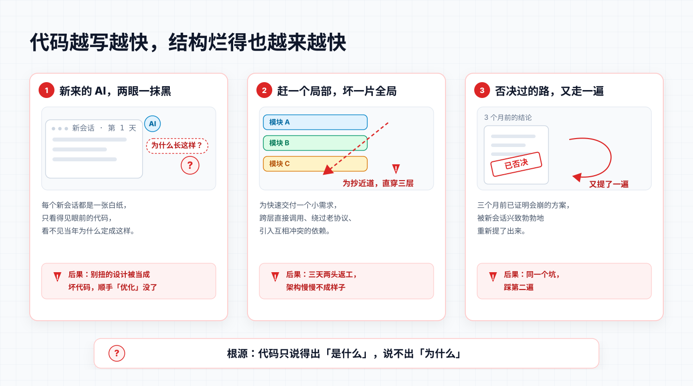
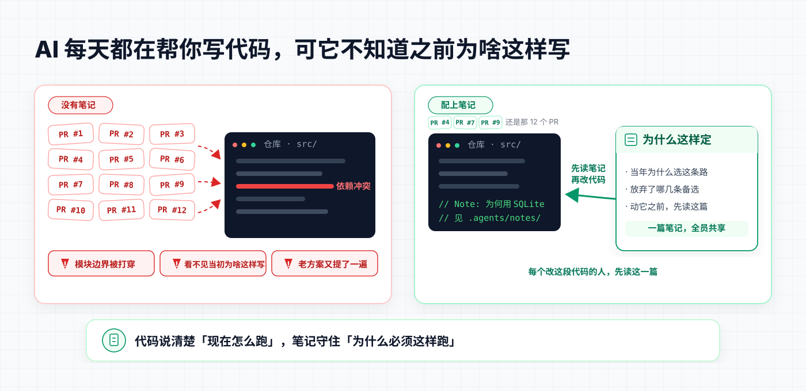
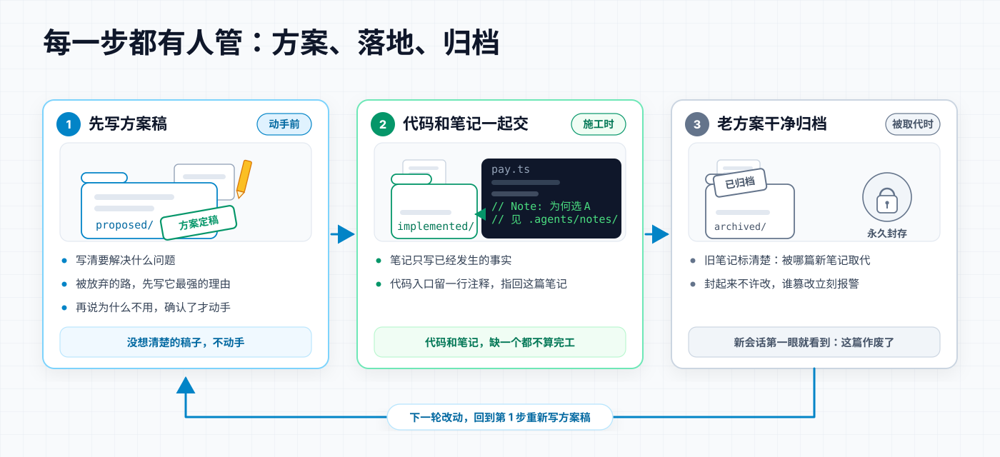
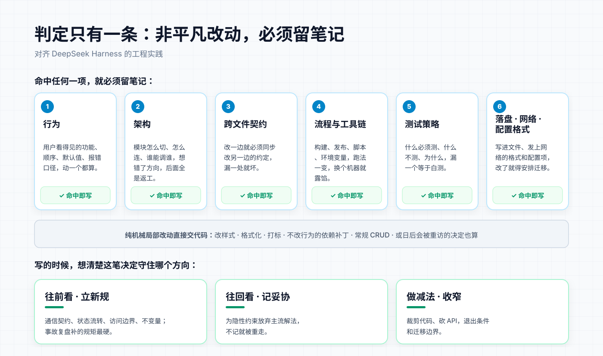
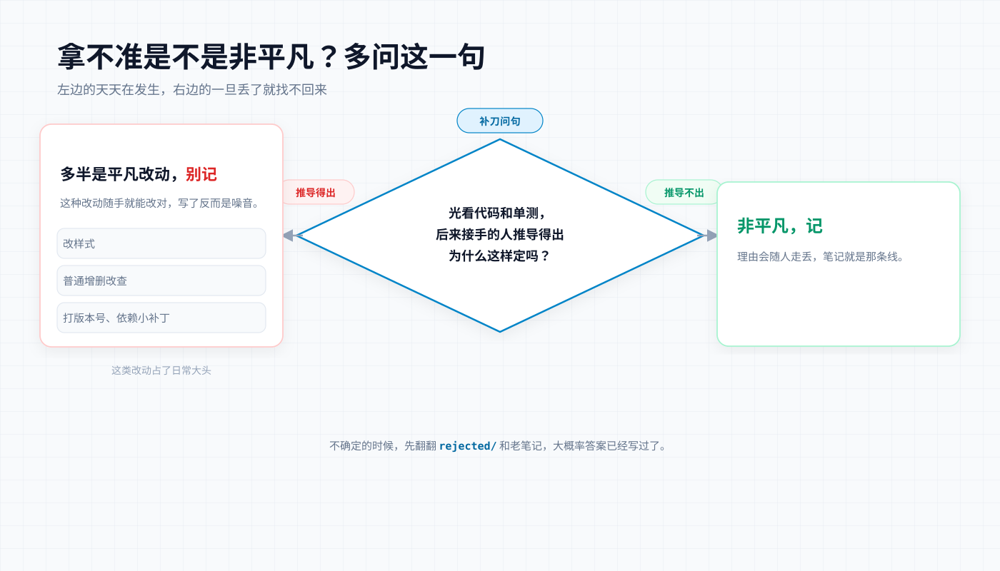
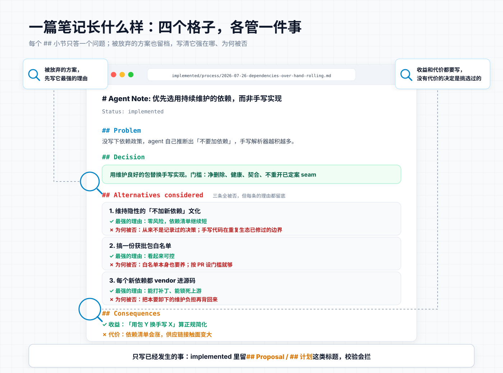
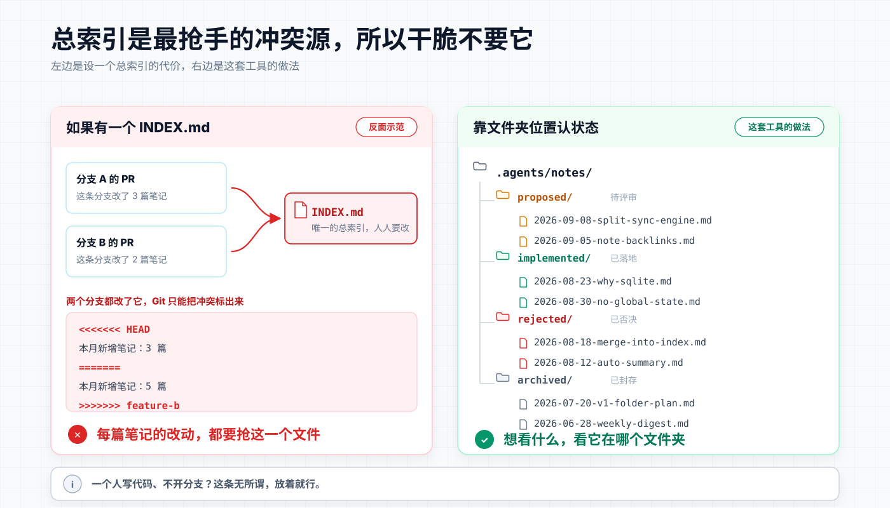
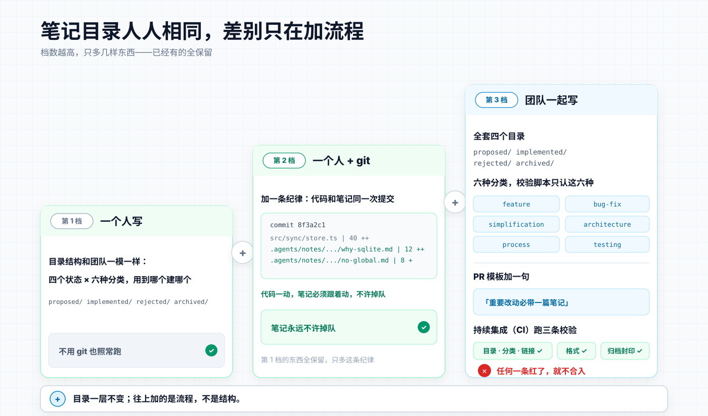

# DDE · Document-Driven Engineering

> **文档驱动工程：像 DeepSeek 团队一样维护项目。** 把他们在 [DeepSeek Harness](https://github.com/deepseek-ai/deepseek-harness) 里用的那套决策笔记方法装进你的仓库——并把它扩展成一套完整的证据链、检索协议与实时 Wiki。

[](https://agentskills.io)
[](LICENSE)
[](https://github.com/czm15053/write-notes-like-deepseek)

> 🙏 **致谢**：本项目 fork 自 [czm15053/write-notes-like-deepseek](https://github.com/czm15053/write-notes-like-deepseek) 并在其基础上大幅改造（方法论本身源自 [DeepSeek Harness](https://github.com/deepseek-ai/deepseek-harness) 的开源实践）。核心判定体系、生命周期目录结构与机械门禁哲学直接继承自原作者的工作，感谢 [@czm15053](https://github.com/czm15053) 的开源贡献。DDE 在其上扩展了：笔记↔代码证据链（Scope/Supersedes/Last-verified 元数据）、统一检索 CLI、决策图谱、模块 Wiki、深色模式与存量项目文档重构模式。

```bash
npx skills add NianLog/DDE
```

AI 每天都能帮你交十几个 PR，但每个新会话都是一张白纸，看不见仓库里已经立过的规矩。DeepSeek 团队用写在仓库里的笔记解决这件事；上游项目把它做成 Skill；DDE 在此之上把「文档」真正变成工程的地基：**决策可追溯、代码可反查、模块有百科、老化有预警、存量可重构。**

---

## 当 AI 每天帮你交十几个 PR，代码库会怎样失控

<p align="center">
  
</p>

代码越写越快，结构烂得也越来越快——这是 AI 密集编码时代的新问题：

1. **新来的 AI 看不见当初为什么这样定。** 每个新会话都是一张白纸，只看得见眼前的代码。一段写得很别扭的代码，往往是当年为了避免死锁、为了兼容某个约束故意为之；AI 不知道，就会自作聪明地「优化」掉它。
2. **为赶一个局部需求，打穿全局结构。** AI 极其擅长单点突破，但没有全局视野：跨层直接调用、绕过老协议、引入互相冲突的依赖，一天一个坑。
3. **被否过的老路被一遍遍重新提出。** 三个月前已经证明会内存溢出的方案，新会话又兴致勃勃地提了一遍——因为没人把「这条路试过了，不行」写下来。

根源只有一句话：**代码只能表达「系统现在怎么跑」，表达不了「为什么必须这样跑、以及放弃了什么」。**

靠提示词提醒 AI「请注意架构」是没有用的。DeepSeek Harness 团队在自己的代码库里验证过：**coding agent 遵守「被强制的门」的可靠性，远高于遵守散文式约定**——而且干活的劳动力已经是 AI，「做门禁太麻烦」这个理由本身就不成立。

所以规矩必须写成 AI 绕不开的形式：和代码**同仓库**（必然读到）、**同一次改动**（必然同步）、**机械校验**（必然遵守）、旧决定**封存带封印**（篡改了会报警）。

### 装上它之后：AI 从「代码推土机」变回「懂规矩的搭档」

<p align="center">
  
  <br>
  <em>左边没有笔记：每天十几个 PR 把仓库冲乱。右边有笔记：同样的代码库按规矩改。</em>
</p>

**没有它时：**

> **你**：「给插件加个实时进度通知。」
> **AI**：「已完成：在宿主内核新增 `getProgress()` 方法，所有插件可直接调用 ✅」
>
> 三个月后：四个插件绕开消息通道直连内核，微内核成了乱炖——而当初那个「多此一举」的消息通道约定，已经没人记得为什么。

**装上它后：**

> **你**：「给插件加个实时进度通知。」
> **AI**：（先跑 `notes.ts query --scope src/plugins/progress.ts`）「这涉及跨插件通信。仓库笔记里立着规矩：所有跨插件通信必须走消息通道，哪怕多一层序列化开销。我已在 `proposed/` 按这个约束起草了方案，对比了两条备选，请你过目后再施工。」

一句台词的差别：动手之前，先看见当初为什么这样定——而这次检索是**机械可执行的**，不靠 AI 自觉。

---

## 它是怎么转起来的：三步闭环

<p align="center">
  
</p>

1. **动手前，先写方案稿**（放进 `proposed/`）：要解决什么问题、考虑过哪几条路——每条被放弃的路，先写它**最强的理由**，再解释为什么不用。想清楚后施工（有评审就走评审，一个人写就自己拍板）。
2. **代码和笔记一起交**：落地后方案稿转为 `implemented/`，只许用现在时写「已经发生的事」（门禁只拒提案标题）。
3. **老方案被取代时，干净归档**：新笔记接管并承继旧理由；能删则删，否则物理移入 `archived/` 并只插一行 `Archived:`——是源码级的归档，不是改个状态字段。

   封存是机械的，不靠自觉：

   - 每篇归档笔记记入 `manifest.json` 的 SHA-256 封印，此后**只增不改**——谁动了归档里的一个字，校验当场报警；
   - **死链不过夜**：归档那一刻，脚本列出所有还链着旧笔记的引用清单，逐条修完才算完；
   - 旧笔记从此不参与日常校验，但也永远不会丢——新会话再想走回头路，会先撞见归档快照和新笔记里的互链。

---

## DDE 的扩展：把证据链焊死

上游项目回答了「为什么写笔记」；DDE 进一步回答「证据链如何不被时间冲散」。三个机器可读的头部元数据（全部可选、全部有门禁）：

```markdown
Status: implemented
Scope: src/server/**                       ← 这篇决定管辖哪段代码
Supersedes: archived/architecture/….md     ← 这篇决定取代了谁
Last-verified: 2026-09-21                  ← 上次确认它依然成立是什么时候
```

| 元数据 | 焊死了什么 | 机械效果 |
|---|---|---|
| **Scope** | 笔记 ↔ 代码的双向链路 | `query --scope src/server/session.ts` 一条命令反查管辖笔记；路径失效 verify 当场红 |
| **Supersedes** | 决定翻转的取代链 | 归档 CLI 自动写入 + 吸收完整性检查；决策图谱画虚线取代边 |
| **Last-verified** | 笔记新鲜度 | 高被引笔记超 6 个月未复核，看板亮「承重墙老化」预警——笔记腐化从隐疾变成可视化指标 |

配套的还有**模块 Wiki**：`docs/modules/<模块>.md` 只写「是什么/边界/入口」，决策与取舍一律链接到笔记、**绝不复制叙述**——三层职责分离由脚本机械保证（模块文档出现决策小节即报错、两份模块文档 Scope 重叠即报错），从根上杜绝「同一件事两处叙述、半年后互相矛盾」。

## 什么样的决定值得记

<p align="center">
  
</p>

**DDE 判定红线：非平凡改动必须留笔记。** 改了**行为**、**架构**、**跨文件契约**、**流程与工具链**、**测试策略**，或**落盘 / 网络 / 配置格式**——命中任何一项就写；其他维护者日后可能重访的决定，也一样。纯机械性的局部改动（改样式、格式化、打标、不改行为的依赖补丁、常规 CRUD）直接交代码，不用记。

**写的时候，想清楚这笔决定守住哪个方向：**

- **往前看：给系统立新规。** 新的跨模块通信契约、状态流转规则、访问边界、运行时不变量——比如「所有跨插件通信必须走消息通道」。不写下来，后来的 AI 各写一套、随意击穿模块。
- **往回看：为看不见的约束做过的妥协。** 为了零依赖开箱即用，坚决不引入外部常驻进程；为了崩溃可恢复，宁可放弃内存缓存。当年放弃的往往是更主流、更直觉的解法——不写下来，后来的人只看见「慢」和「土」，把被否掉的路重走一遍。
- **做减法：收窄暴露面、废弃旧东西。** 删代码、砍 API、下线旧流程——退出条件和迁移边界光看代码看不出来。不写下来，没人敢删第二刀；或者删过了头，把还在用的东西一起砍掉。

<p align="center">
  
</p>

### 规矩不能只靠自觉

> 对 AI 来说，写在散文里的规矩，等于没有规矩。

所以这套系统里，几乎每条纪律都有机械牙齿：

- 笔记必须有备选方案、implemented 不许留提案标题 → 校验脚本非零退出，红给你看；
- 目录和类别不许自造 → 树校验直接拦下「第七种分类」；
- Scope 路径失效、模块文档越权写决策、两份文档管辖重叠 → verify 四线拦截；
- 老决定封存 → SHA-256 封印只增不改，篡改当场报警。

Prompt 只负责提醒，脚本负责咬合。你不需要相信 AI 的自觉，只需要相信非零退出码。

---

## 一篇笔记长什么样

摘自 DeepSeek Harness 现行笔记（有删节）：`.agents/notes/implemented/process/2026-07-26-dependencies-over-hand-rolling.md`

```markdown
# Agent Note: 优先选用持续维护的依赖，而非手写实现

Status: implemented

## Problem

仓库没写依赖政策，agent 从「外部依赖很少」推断出「不要加依赖」，比任何人实际决定过的都严。手写的 SSE 解析器、协议分帧器、重试循环，每一份都要自己测、自己审，却吃不到生态已经修过的边界情况。

## Decision

引入维护良好的外部依赖（或引擎下限已提供的 Node 内置）来替换手写实现，是正当的简化。门槛：净删除我们维护的代码；包要健康；语义要契合；不重开已定案的 seam。

## Alternatives considered

- **维持隐性的「不加新依赖」文化** — 最省事，但它从来不是一项有记录的决策；代价是手写协议和解析代码重复实现久经实战的库，评审还得重推一遍生态已修过的边界。
- **一份获批包的硬性白名单** — 看起来可控。但仓库还在预发布、依赖集合很小；按 PR 设证据门槛再加评审，不必再养一份白名单。

## Consequences

- **收益**：巡查简化时，「用包 Y 替换手写的 X」算正规产出。
- **代价**：依赖清单会增长，供应链接触面随之扩大；扫描和更新节奏另有提案管。
```

三个要点：**被放弃的方案先写最强理由再否决**（防止后人翻案）；**收益和代价都写**（没有代价的决定是挑选过的）；**只写已经发生的事**——`## Decision` 用现在时。

<p align="center">
  
</p>

---

## 目录就是状态，没有总索引

路径格式严格遵循：`{走到哪一步}/{哪一类}/yyyy-mm-dd-主题.md`

```
.agents/notes/
├── proposed/       # 动手前：方案稿，写清背景、备选与验收标准
├── implemented/    # 已落地：只写现在时事实，随代码一起改
├── rejected/       # 被否决：写明原因防重犯，没价值就删
└── archived/       # 已封存：完成使命的旧决定，永久只读，改了会报警
```

笔记分六种，不许自造类别（校验脚本会拦）：`feature` 新能力 / `bug-fix` 修缺陷 / `simplification` 只删不增 / `architecture` 结构决策 / `process` 流程工具 / `testing` 测试策略。

<p align="center">
  
</p>

**为什么没有一个总的 INDEX.md？** 因为多分支、多人同时开发时，总索引是最抢手的冲突源。文件夹位置本身就是状态；检索交给 `query` 命令和看板。Wiki 视图是**派生的**索引——由模块文档 + Scope 元数据实时聚合，零维护、永不腐化。

### 个人写、团队写，差别只在加多少流程

<p align="center">
  
</p>

| 你的处境 | 在相同底座上加什么 |
|---|---|
| **一个人写** | 不加。目录结构照标准建，装上 Skill 就开写；不用 git 也照常跑。 |
| **一个人 + git** | 加一条纪律：代码和笔记**同一次提交**，不让笔记掉队。 |
| **团队开发** | 加评审、PR 模板提一句「重要改动必带一篇笔记」、CI 接上 `notes.ts verify` 四线校验。 |

---

## 本地校验与检索：一条命令，零依赖

> 只依赖 Node.js ≥ 18。统一入口 `notes.ts`，也可拷贝 `scripts/` 进任何项目直接跑。

```bash
# 四线校验（CI 用这个）：目录树 / 头部格式与元数据 / 归档封印 / 模块文档契约
npx tsx scripts/notes.ts verify

# 检索三式 —— AI 动手前的标准动作（--json 输出路径 + 行号锚点，供 Agent 直接回读源文件）
npx tsx scripts/notes.ts query --scope src/server/session.ts   # 反查管辖这段代码的笔记
npx tsx scripts/notes.ts query --topic "会话持久化"             # 全文检索（含备选与代价）
npx tsx scripts/notes.ts query --related <笔记路径> --archived  # 血缘邻域 + 取代链

# Agent 资产索引：一次编译全库资产/关系/新鲜度，机器可读（详见下节）
npx tsx scripts/notes.ts index              # 生成/刷新 .agents/index.json
npx tsx scripts/notes.ts touch <笔记>       # 核对一致后刷新 Last-verified，随后 index

# 老方案被取代，一键归档：Archived 标记 + SHA-256 封印 + 死链报告
#   + 新笔记写入 Supersedes 元数据 + 吸收完整性检查
npx tsx scripts/notes.ts archive .agents/notes/implemented/<类>/<文件>.md \
  --superseded-by .agents/notes/implemented/<类>/<新笔记>.md

# 可选体检：代码里若有 // Note: 锚点，是否指着不存在的笔记（软报告）
npx tsx scripts/notes.ts anchors
```

团队场景可以直接抄本仓库的 [.github/workflows/verify-notes.yml](.github/workflows/verify-notes.yml)，每次推代码和提 PR 时自动跑四线校验 + 索引同步检查。

## Agent 检索接口：`.agents/index.json`

AI Agent 每次进项目都要重新「了解这个项目」——扫全库、重建认知，token 和时间都花在重复劳动上。DDE 把这件事变成一次编译：

```bash
npx tsx scripts/notes.ts index    # 编译资产索引并提交，Agent 开工直接读
```

索引内容（`dde-agent-index/1` schema，全部仓库相对路径）：

- **notes[]** — 每篇笔记的元数据、Decision 摘要、`bodySha256` 内容哈希，以及 **来源行号锚点**（`lines.status / scope / supersedes / sections[]`）——Agent 知道去哪个文件第几行核对或更新；
- **关系** — 引用（cites/citedBy）与取代链（supersedes/supersededBy）双向展开；
- **freshness** — 超 6 个月未复核的笔记标 `stale`，附「必须回读源码」警示；
- **modules[]** — 模块文档的 Scope、管辖笔记、重叠告警。

**防误导契约**（写进了索引头的 disclaimer 与 SKILL）：索引是派生快照，不是事实源——涉及代码修改、实现细节核对或条目 stale 时，Agent 必须按 `path`/`lines` 回读源文件与代码库本身；代码审查永远直接读代码。CI 的 `notes.ts index --check` 用内容哈希拦截漂移：笔记改了、索引没重建，直接红。规范见 [references/agent-interface.md](references/agent-interface.md)。

### 装上 Skill 之后

```bash
npx skills add NianLog/DDE
```

把以下规则加入项目的 `AGENTS.md` 或 `CLAUDE.md`，AI 就会自动遵守：

```markdown
## 重要改动必须留笔记

1. 非平凡改动（改了行为、架构、跨文件契约、流程与工具链、测试策略、落盘/网络/配置格式）前，遵循 DDE Skill（安装于 `.agents/skills/dde/SKILL.md`，以实际安装路径为准）写或更新笔记；机械性小改（样式、格式化、打标、不改行为的补丁）直接提交。
2. 动手前先检索：`npx tsx scripts/notes.ts query --scope <要改的路径>`（有 scripts/ 时），否则按 SKILL §3 手动检索 .agents/notes/ 同主题旧笔记：有归属就地更新；新想法先放 proposed/，落地随同代码改动转 implemented/；新方案彻底取代旧决策时，同批归档旧篇并标明被谁取代。
3. 被放弃的方案先写它最强的理由，再解释为什么不用。
4. 提交前跑 npm run verify，红了先修再交。
```

**日常使用就一句话**——像平时一样提需求，改动大的时候点名让它先立笔记：

```text
把鉴权模块从 Session 重构成 JWT，改动比较大，
动手前先按 DDE 立一篇 Note。
```

---

## 快速接入：两种起点，两条路径

真实世界的接入只分两种情况：**从零开始的新项目**（还没有历史包袱）和**已经大量迭代的项目**（代码很多、决策从未记录）。两种起点给 Agent 的第一句话不同，之后走的路也不同——但共同点是一句引导语就能启动，不需要人工搬砖。

### 场景 A：从零开始的新项目

最好的接入时机是第一行代码之前：规矩先于代码立起来，AI 从第一个 PR 起就带着证据链工作，不存在补历史的问题。给 Agent 的第一句话（直接复制）：

```text
这是一个新项目。请先按 DDE（Document-Driven Engineering）Skill 完成初始化：
1. 装 Skill（npx skills add NianLog/DDE），建好 .agents/notes/ 四态目录
   （proposed / implemented / rejected / archived，先不用建类子目录，首篇笔记时按六类建）；
2. 把 Skill 的 scripts/ 拷进本仓库，在 package.json 加 verify 脚本（零依赖，Node ≥ 18 即可）；
3. 在 AGENTS.md / CLAUDE.md 写入「重要改动必须留笔记」规则（规则模板见上一节）；
4. 第一篇笔记从今天要做的第一个非平凡决定写起，放 proposed/，落地后转 implemented/。
之后每个非平凡改动都按 Skill 流程走，提交前跑 npx tsx scripts/notes.ts verify。
```

初始化只是第一次的事。之后日常提需求即可——按 Skill 红线，非平凡改动 Agent 自动立笔记，机械小改直接交代码。从第一篇笔记落地起，就可以让 Agent 顺手生成 Agent 索引（`notes.ts index`）和本地看板（`board --init`），新会话从此不再从零了解项目。

### 场景 B：已经大量迭代的项目

关键认知：**不补写历史**。过去几十个迭代周期做过的决定已无法可靠还原，让 AI 凭代码倒推「当年为什么」，产出的只会是伪造的决策史——比没有笔记更危险，因为它是错的还带着权威口吻。存量项目的证据链从**今天正在做的改动**开始生长。给 Agent 的第一句话（直接复制）：

```text
这个项目已经迭代了很久，但决策从未记录。请按 DDE（Document-Driven Engineering）Skill 接入：
1. 初始化同新项目：装 Skill、建四态目录、拷 scripts/、把规则写进 AGENTS.md；
2. 不补写历史决策；从你接下来做的第一个非平凡改动起立笔记；
3. 考古原则：当你为读懂某段老代码费了劲（绕了弯路才明白它为什么这样写），
   就为它补一篇笔记，Scope 指向那段代码——只在真正接触过、确认过事实时才写；
4. 若仓库里已有散乱文档（旧设计稿 / 过期 ADR / 互相矛盾的 README），先别动，
   报告规模并问我是否启用文档重构模式。
```

第 4 条引出两条分支：

- **仓库里有散乱文档** → 走下一节的[文档重构模式](#存量项目也能救文档重构模式)：勘察与计划阶段只读、成本极低；施工前有强制确认门——AI 会先给出规模、批次与 token 成本估算，并说明「短期成本高，但对项目系统健康是一次性长期投资」，经你确认才开工，也可以只批第一批。
- **仓库本来就没文档** → 直接增量生长。头一两周通常只有两三篇笔记，但这恰恰是 `query` 与索引价值最大的阶段：下一个新会话查一条命令就能接住已有结论，不再重复分析。

两种场景殊途同归：**笔记只在「决定真实发生」的那一刻写**——新项目从第一天就有这个时刻，存量项目从接入的今天起有。

### 团队场景再加一步

把本仓库的 [.github/workflows/verify-notes.yml](.github/workflows/verify-notes.yml) 抄过去接上 CI：四线校验 + 索引同步检查从此机械把关，笔记掉了队 PR 直接红，不靠任何人的自觉。单人项目跳过这步，提交前手跑 `verify` 即可。

---

## 存量项目也能救：文档重构模式

仓库已经堆了几十上百篇散乱文档（过期设计稿、互相矛盾的 README、与代码脱节的 ADR）？DDE 的 Skill 内置**文档重构模式**：

1. **勘察（只读）**：快速分类现有文档（决策型 / 模块型 / 入口型 / 过期型 / 重复型），产出规模表；
2. **计划（只读）**：逐篇映射去向（吸收为笔记 / 转模块文档 / 合并 / 删除），按模块分批；
3. **确认门**：重构是重 token 操作——AI 会先向你呈现规模、批次与成本估算，**明确告知「短期 token 成本高，但对项目系统健康是一次性长期投资」，经你确认后才开工**；你可以说「先只做第一批」。
4. **分批执行**：每批转换 → 校验转绿 → 保活代码锚点 → 删除原稿 → 汇报。

完整手册见 [`references/remediation.md`](references/remediation.md)。

---

## 辅助工具：决策看板

一条命令生成单文件 `board.html`，双击就能看。日常开发中直读本地笔记目录（改了笔记切回浏览器自动热刷新），也可打包成单文件分发：

```bash
npx tsx scripts/notes.ts board --init board.html "项目决策看板"     # 本地直读，热更新
npx tsx scripts/notes.ts board --bundle .agents/notes demo.html "项目决策看板"  # 打包分发
```

六个视图：

- **架构基线**——KPI 总览与「系统承重墙」（按被引权重萃取的关键决策，圆点颜色标新鲜度）；
- **演进时间线**——月份 × 分类 × 状态三维切片，无日期笔记不再静默丢失；
- **避坑智库**——全库被放弃方案的「最强理由 + 为何否掉」清单；
- **决策图谱**——引用边 + 取代边的交互式力导向图，滚轮缩放、拖拽平移、点节点直达笔记；
- **模块 Wiki**——模块文档 + 按 Scope 聚合的管辖决策 + 模块健康度灯（红 = 有决策超 6 个月未复核）；
- **决策清单**——全文检索（含备选与代价）+ 高亮 + 分页。

还有：深色模式、数据来源徽章（离线快照 / 本地直读一目了然）、笔记阅读抽屉（完整小节 + 目录导航 + 上下篇 + 取代链）。

---

## 仓库导览

- [`SKILL.md`](SKILL.md)：装给 AI 的主契约——先判「要不要写」，再谈怎么写；含存量重构模式。
- [`templates/`](templates/)：`proposed` / `implemented` / `rejected` 三份填空模板（含 schema v2 元数据说明）。
- [`references/when-to-write.md`](references/when-to-write.md)：什么时候写、什么时候原地改、什么时候归档。
- [`references/remediation.md`](references/remediation.md)：存量项目文档重构全流程（勘察 → 计划 → 确认门 → 分批执行）。
- [`references/module-wiki.md`](references/module-wiki.md)：模块 Wiki 规范——三层职责分离与机械校验。
- [`references/archiving.md`](references/archiving.md)：封存规矩——被取代的老决定怎么干净归档。
- [`references/note-format.md`](references/note-format.md)：头块、元数据块与骨架展开。
- [`references/quality-gate.md`](references/quality-gate.md)：写完笔记后的语义自检清单。
- [`references/verification.md`](references/verification.md)：每个校验/检索脚本在查什么、为什么。

## 友情链接

- [LinuxDo](https://linux.do) — 真诚、友善、团结、专业，你的品质开源与技术社区

## 许可证

[MIT](LICENSE)
